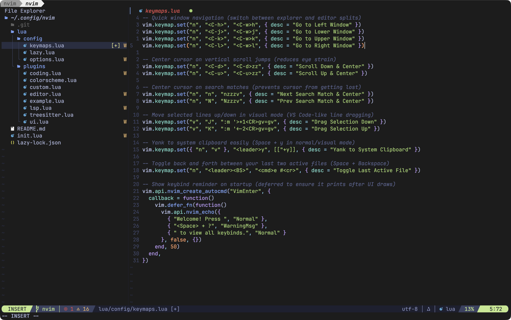
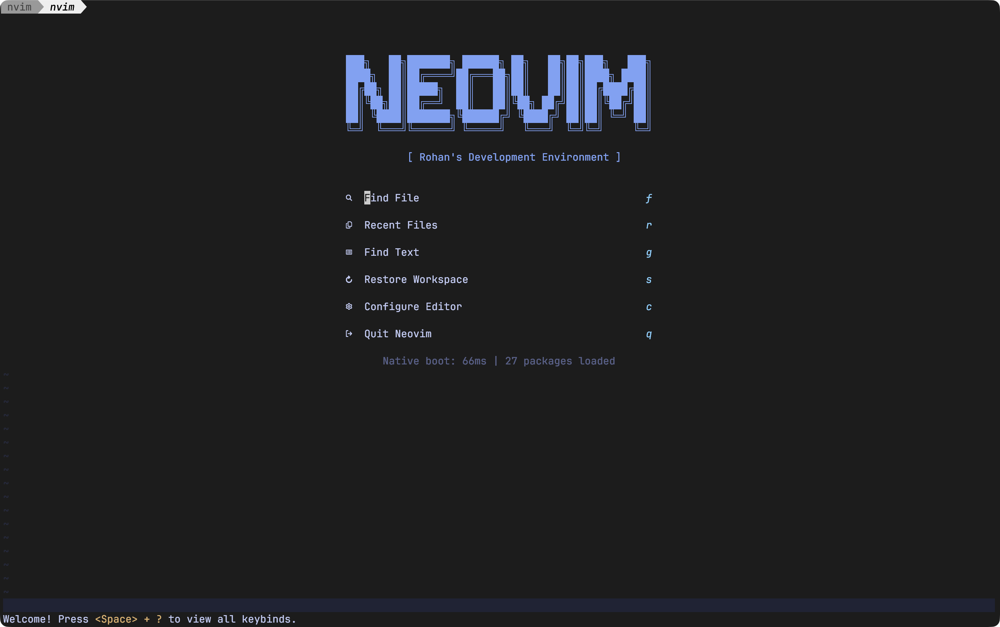

# Custom Neovim Configuration

A clean, modern, and high-performance custom Neovim configuration utilizing Neovim's built-in native package manager. It includes native LSP integration, treesitter syntax highlighting, fuzzy finding via Telescope, a fully featured file explorer, an interactive statusline, a visual buffer/tab bar, git gutter integrations, a popup keymap helper, automatic formatting on save, a beautiful diagnostics panel, an interactive welcome dashboard, workspace session persistence, and quick file pinning via Harpoon.

## 📷 Screenshots

### Welcome Dashboard

### Code Editor & Autocomplete

* **Leader Key:** `Space` (represented as `<leader>` below)

---

## 📖 Documentation & Installation

> [!NOTE]
> For complete installation instructions, system prerequisites, and a line-by-line personalization guide, please refer to the **[Documentation](DOCUMENTATION.md)**.

---

## General Window Navigation
Quickly switch focus between splits (e.g., between the file explorer and the file editor).

| Keybind | Action | Description |
|---|---|---|
| `Ctrl + h` | **Move to Left Window** | Switches focus to the file explorer (or any split on the left) |
| `Ctrl + l` | **Move to Right Window** | Switches focus to the file editor (or any split on the right) |
| `Ctrl + j` | **Move to Lower Window** | Switches focus to the window below |
| `Ctrl + k` | **Move to Upper Window** | Switches focus to the window above |
| `Ctrl + w` then `w` | **Cycle Windows** | Neovim's default way to cycle focus through all open splits |

---

## Ergonomic Editing & Navigation
Highly productive editing utilities and comfortable navigation helpers that reduce eye strain and speed up text manipulation.

| Keybind | Action | Description |
|---|---|---|
| `Ctrl + d` | **Scroll Down & Center** | Page-down through your file and automatically lock the cursor in the center of the screen |
| `Ctrl + u` | **Scroll Up & Center** | Page-up through your file and automatically lock the cursor in the center of the screen |
| `n` | **Next Match & Center** | Jump to the next search match and lock the cursor in the center of the screen |
| `N` | **Prev Match & Center** | Jump to the previous search match and lock the cursor in the center of the screen |
| `J` (Visual Mode) | **Drag Selection Down** | Slide the selected block of code down one line and auto-indent it |
| `K` (Visual Mode) | **Drag Selection Up** | Slide the selected block of code up one line and auto-indent it |
| `<leader>y` (Space + y) | **Copy to System Clipboard** | Yank selection (or current movement) directly to your OS system clipboard |
| `<leader><BS>` (Space + Backspace) | **Toggle Last Active File** | Instantly toggle back and forth between your last two active files |

---

## Helix-Style Editing & Navigation
This configuration incorporates keybindings and plugins that bring Helix's best features to Neovim.

### Navigation & Editing
| Keybind | Action | Description |
|---|---|---|
| `gh` | **Go to line start** | Helix-style jump to start of line |
| `gl` | **Go to line end** | Helix-style jump to end of line |
| `ge` | **Go to file end** | Helix-style jump to end of file |
| `gs` | **Go to first non-whitespace char** | Helix-style jump |
| `mm` | **Match pairs** | Jump between matching brackets/parentheses |
| `x` | **Select whole line** | Helix-style visual line selection |
| `U` | **Redo** | Helix-style redo |

### Multiple Cursors (`vim-visual-multi`)
| Keybind | Action | Description |
|---|---|---|
| `Ctrl + n` | **Add Cursor / Select Next** | Select current word and add a cursor. Press again for next occurrence. |

### Surround Operations (`nvim-surround`)
| Keybind | Action | Description |
|---|---|---|
| `ms` | **Match Surround** | Add surroundings (e.g., `ms"` wraps word in quotes) |
| `md` | **Match Delete** | Delete surroundings (e.g., `md"` removes quotes) |
| `mr` | **Match Replace** | Change surroundings |

### Tree-sitter Textobjects
| Keybind | Action | Description |
|---|---|---|
| `Alt-o` | **Expand Selection** | Helix-style logical expansion based on syntax |
| `Alt-i` | **Shrink Selection** | Helix-style logical shrink |
| `mif` / `maf` | **Match Function** | Match inside/around function |
| `mic` / `mac` | **Match Class** | Match inside/around class |

---

## 1. Workspace Searching (Telescope)
Fuzzy-find files, search code text, and manage buffers across your workspace.

*(Note: If you open a directory like `nvim .`, Neovim will automatically launch Telescope instead of a sidebar explorer!)*

| Keybind | Action | Description |
|---|---|---|
| `<leader>ff` or `<leader><Space>` | **Find Files** | Fuzzy-search any file in your project by name |
| `<leader>fg` | **Live Grep** | Search for specific text inside all files in your project |
| `<leader>fb` | **Find Buffers** | List and fuzzy-search all currently open files |
| `<leader>fh` | **Find Help** | Search Neovim's help documentation |
| `<leader>?` or `<leader>sk` | **Search Keymaps** | Interactive, searchable popup of all active keyboard shortcuts |

### Navigation Inside Telescope Menu:
* `Ctrl + j` — Move selection down
* `Ctrl + k` — Move selection up
* `Enter` — Open selected file

---

## 2. File Explorer (oil.nvim)
Edit your filesystem like a normal Neovim buffer. Replaces heavy sidebars with a blazing fast, minimalist approach.

| Keybind | Action | Description |
|---|---|---|
| `-` or `<leader>e` | **Open Oil** | Open the parent directory in an editable buffer |
| `Enter` | **Open File/Dir** | Open the selected file or directory |
| `o` | **Create File/Dir** | Create a new file (or directory if ending with `/`) by inserting a line |
| `:w` | **Save Changes** | Apply any creations, renames, or deletions to disk |

---

## 3. Language Server Protocol (LSP)
Advanced code intelligence, diagnostics, and navigation. Runs automatically for supported languages.

| Keybind | Action | Description |
|---|---|---|
| `gd` | **Go to Definition** | Jump to where the hovered function or variable is defined |
| `K` | **Hover Docs** | Show type signatures, parameters, and documentation in a popup |
| `gr` | **Go to References** | List all files and lines where the hovered symbol is used |
| `<leader>rn` | **Rename Symbol** | Safely rename the hovered variable/function across your entire project |
| `<leader>ca` | **Code Actions** | Trigger quick-fixes, automatic imports, and refactoring suggestions |

---

## 4. Auto-Completion & Inline Ghost Text (nvim-cmp)
Automatic dropdown completions and inline ghost text previews.

As you type, a pop-up menu will appear. The top suggestion is also displayed directly in your code as light-grey **inline ghost text**.

| Keybind | Action | Description |
|---|---|---|
| `Tab` | **Next / Expand** | Select the next completion item, or expand/jump forward in a snippet |
| `Shift + Tab` | **Prev / Jump Back** | Select the previous completion item, or jump backward in a snippet |
| `Ctrl + Space` | **Trigger** | Manually open the completion menu |
| `Ctrl + e` | **Close** | Abort and close the completion menu |
| `Enter` | **Confirm** | Insert the currently selected item |

---

## 5. Buffer Navigation & Tabline (bufferline.nvim)
A visual tab bar at the top of your editor displaying all open files (buffers) with language icons and diagnostics.

| Keybind | Action | Description |
|---|---|---|
| `Shift + h` | **Previous Buffer** | Switch to the previous open file/buffer |
| `Shift + l` | **Next Buffer** | Switch to the next open file/buffer |
| `<leader>bd` | **Delete Buffer** | Close/delete the current file/buffer without closing your window split |

---

## 6. Git Gutter & Integration (gitsigns.nvim)
Real-time, colored git diff indicators in the left sign column (gutter) and interactive git operations.

### Git Gutter Indicators:
* `▎` (Green) — Line added
* `▎` (Yellow) — Line modified
* `` (Red) — Line deleted
* `░` (Grey) — Mixed change/delete

### Git Keybinds:
| Keybind | Action | Description |
|---|---|---|
| `]c` | **Next Hunk** | Jump to the next changed block of code |
| `[c` | **Prev Hunk** | Jump to the previous changed block of code |
| `<leader>hs` | **Stage Hunk** | Stage the changed block of code under the cursor |
| `<leader>hr` | **Reset Hunk** | Discard/revert the changed block of code under the cursor |
| `<leader>hS` | **Stage Buffer** | Stage all changes in the current file |
| `<leader>hu` | **Undo Stage** | Undo the last staged hunk |
| `<leader>hR` | **Reset Buffer** | Discard/revert all changes in the current file |
| `<leader>hp` | **Preview Hunk** | Show a floating popup containing the git diff for the current hunk |
| `<leader>hb` | **Blame Line** | Show git blame information (author, commit, date) for the current line |
| `<leader>tb` | **Toggle Blame** | Toggle virtual text showing git blame at the end of the current line |
| `<leader>hd` | **Diff Index** | View diff of the current file against the git index |
| `<leader>hD` | **Diff Commit** | View diff of the current file against the last commit |
| `<leader>td` | **Toggle Deleted** | Toggle inline display of deleted lines |

---

## 7. Keymap Helper (which-key.nvim)
A clean, interactive popup panel at the bottom of the screen that automatically appears when you press a prefix key (like `<leader>`, `g`, or `z`), displaying all available keybinds and their descriptions.

Simply press `<leader>` (Space) or any other prefix key and wait for a second to see the interactive menu of all registered keymap prefixes and actions!

---

## 8. Auto-Formatting on Save (conform.nvim)
A lightweight formatter runner that automatically runs industry-standard formatters every time you save a file (`:w`), or manually via a keybind.

### Configured Formatters:
* **Lua:** StyLua (`stylua`)
* **JavaScript / TypeScript / HTML / CSS / JSON / Markdown:** Prettier (`prettier`/`prettierd`)
* **Python:** Black (`black`)
* **Shell Scripts:** shfmt (`shfmt`)
* **Rust:** rustfmt (`rustfmt`)
* **Go:** gofmt, goimports

### Keybinds:
| Keybind | Action | Description |
|---|---|---|
| `<leader>cf` | **Format Code** | Manually formats the current buffer or visually selected range |

---

## 9. Diagnostics Panel (trouble.nvim)
A beautiful, interactive split panel at the bottom of your screen listing all syntax errors, warnings, and hints in your project.

| Keybind | Action | Description |
|---|---|---|
| `<leader>xx` | **Workspace Diagnostics** | Toggle the Trouble panel showing errors in the entire project |
| `<leader>xX` | **Buffer Diagnostics** | Toggle the Trouble panel showing errors in the current active file |
| `<leader>cs` | **Symbols** | Toggle a sidebar showing document symbols (functions, classes, variables) |
| `<leader>cl` | **LSP Definitions/References** | Toggle a panel showing LSP definitions, references, and implementations |
| `<leader>xL` | **Location List** | Toggle Neovim's location list in Trouble |
| `<leader>xQ` | **Quickfix List** | Toggle Neovim's quickfix list in Trouble |

---

## Workspace Session Persistence (persistence.nvim)
Automatically saves your open tabs, buffers, and window splits when you exit Neovim in a project folder, and allows you to restore them instantly upon reopening.

| Keybind | Action | Description |
|---|---|---|
| `<leader>qs` | **Restore Session** | Restore the saved session for the current working directory |
| `<leader>ql` | **Restore Last Session** | Restore the last active session globally |
| `<leader>qd` | **Don't Save Session** | Disable session saving for the current Neovim execution |

---

## 12. Quick File Pinning & Switching (harpoon2)
Allows you to pin your 3-4 most-used files in a project and switch between them instantly using single-key shortcuts, bypassing tabs and search lists.

| Keybind | Action | Description |
|---|---|---|
| `<leader>ha` | **Harpoon File** | Pin the current file to the Harpoon list |
| `<leader>he` | **Harpoon Menu** | Toggle the interactive quick menu to view and organize pinned files |
| `<leader>1` | **Select File 1** | Instantly switch to the 1st pinned file |
| `<leader>2` | **Select File 2** | Instantly switch to the 2nd pinned file |
| `<leader>3` | **Select File 3** | Instantly switch to the 3rd pinned file |
| `<leader>4` | **Select File 4** | Instantly switch to the 4th pinned file |

